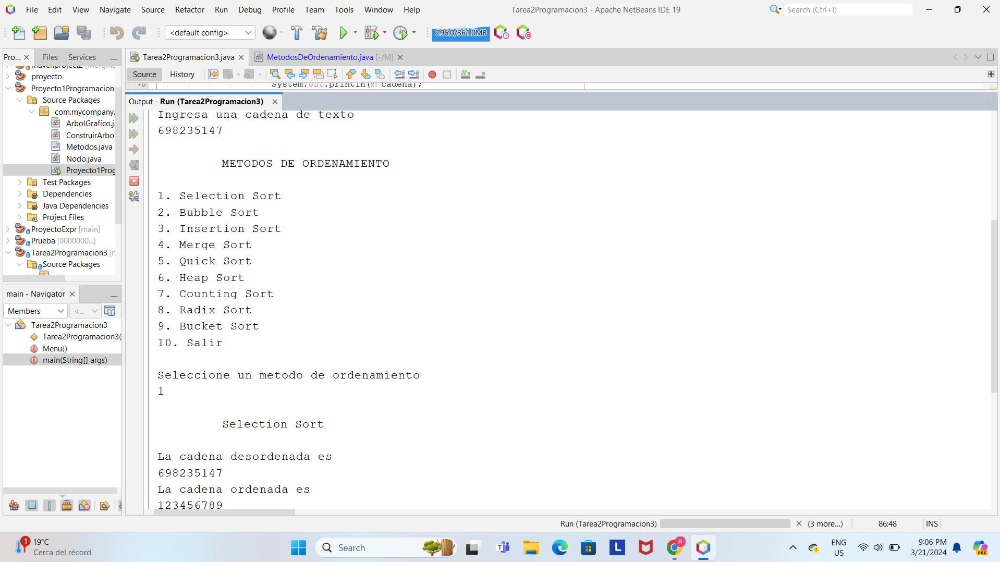
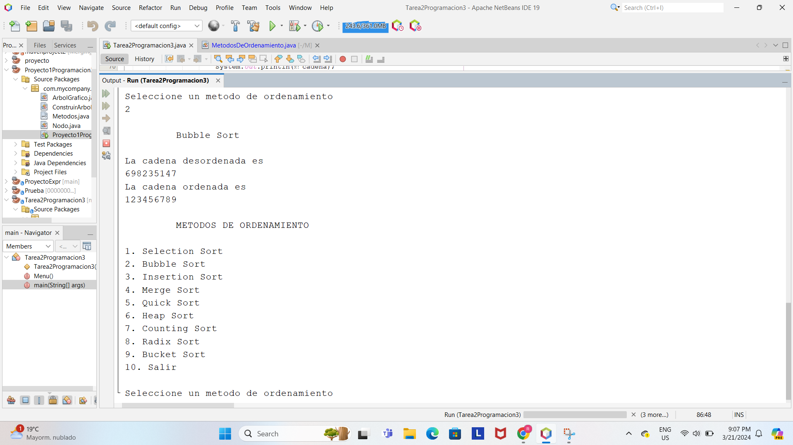

# Tarea 2 - Metodos De Ordenamiento

* [x] Selection sort (selección)
* [x] Bubble sort (burbuja)
* [x] Insertion sort (inserción)
* [x] Merge sort (combinación)
* [x] Quick sort (rápida)
* [x] Heap sort (montón)
* [x] Counting sort (conteo)
* [x] Radix sort (raíz)
* [x] Bucket sort (cubo)

